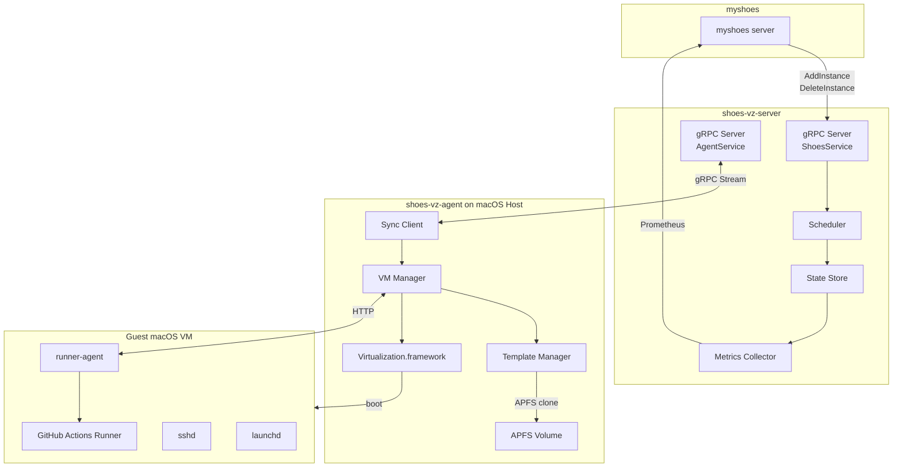
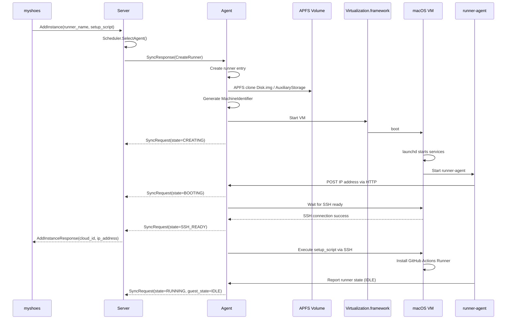
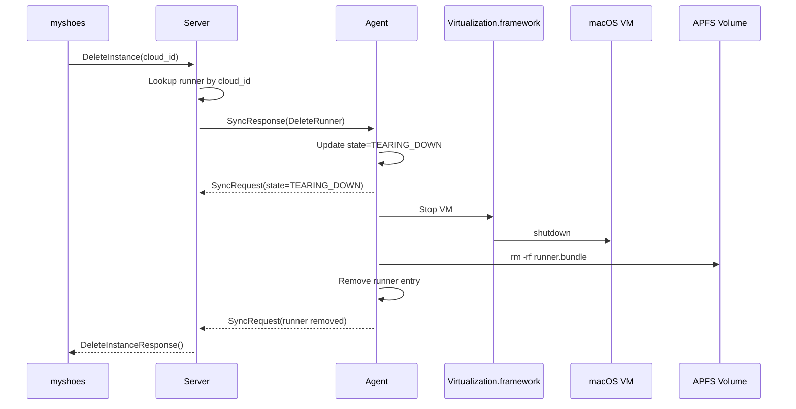

# shoes-vz Design Document

## Overview

shoes-vz は、macOS 26+（Apple Silicon）上で **Code-Hex/vz（Apple Virtualization Framework の Go バインディング）** を直接利用し、GitHub Actions self-hosted runner を **エフェメラルな macOS VM** として高速に生成・実行・破棄するツール（および将来のサービス）群です。

従来の GUI ベース仮想化アプローチが持つ以下の性質を置き換えます：

- GUI アプリケーションを介した間接制御
- 圧縮・展開に依存したテンプレート準備
- ブリッジ + 固定 IP + mDNS を組み合わせた疎通

本システムでは、Virtualization.framework を **直接制御**し、APFS の Copy-on-Write（clone）を用いた **CoW 的 Runner 複製**を中核に据えることで、SSH 到達（SSH possible）を起動完了条件としたときの起動時間を最短化します。

---

## Motivation

### 背景・課題

1. **コスト問題**
   - GitHub 公式 macOS Runner の課金が高く、長時間ジョブでコストが支配的になりやすい。

2. **Apple Silicon 対応**
   - ARM64（aarch64）向けビルド環境が必要。

3. **エフェメラル環境の必要性**
   - ジョブごとにクリーンな環境が必要で、状態汚染を防ぎたい。

4. **運用・開発の複雑性**
   - GUI 前提の副作用（状態の不透明さ、操作・復旧フローの複雑化）
   - 起動パスの最適化が困難（不要処理が混入しやすい）

---

## Goals

- **SSH Ready 最速化**
  - 起動完了条件を「SSH 接続成功」に統一
- **エフェメラル Runner**
  - Runner ごとに完全に独立した VM 個体（同時並行でも衝突しない）
- **CoW ベースの高速複製**
  - テンプレートを APFS clone で瞬時に複製し、差分だけが増える構造
- **macOS 26+ 前提**
  - Virtualization.framework の最新機能を前提
- **CLI / API 中心設計**
  - GUI 非依存。将来の gRPC/HTTP API 化を想定
- **myshoes 連携**
  - Runner ライフサイクルを外部から制御可能

---

## Non-Goals

- **Linux / Windows VM サポート**
- **VM 起動後の動的リソース変更**
- **GUI 操作前提の運用**
- **ゲスト OS への依存を増やす設計**
  - Runner の状態管理はホスト側で完結

---

## Design Details

### 5.1 想定されるユーザ（myshoes / 運用者）の利用の流れ

#### 初期セットアップ（1回のみ）

1. **前提条件**
   - ホスト: macOS 26+ / Apple Silicon / APFS
   - Virtualization.framework 利用可能
   - Runner 用のベース VM（Golden Template）を作成する権限

2. **Golden Template 作成（Maintenance Path）**
   - macOS を VM にインストール
   - SSH 有効化、Runner ユーザ作成、authorized_keys 配置
   - GitHub Actions runner バイナリを配置（必要に応じて）
   - 初回起動時の重い処理（ホストキー生成、パッケージ導入等）を完了

3. **テンプレートを固定化**
   - VM バンドル（Disk / Auxiliary / HardwareModel 等）をテンプレートディレクトリへ格納
   - テンプレートは read-only 運用（書き込みは禁止）

#### 日常的な利用フロー（Fast Path）

1. Runner 作成（APFS clone）
2. VM 起動
3. SSH Ready 判定（成功で起動完了）
4. ジョブ実行（SSH or Runner agent）
5. 破棄（VM 停止 + バンドル削除）

---

### 5.2 アーキテクチャ概要

従来の GUI ベース制御（アプリ起動・ブリッジ監視・mDNS 重複チェック等）を廃止し、Server-Agent アーキテクチャで実装します。

#### コンポーネント

- **shoes-vz-server（Go）**
  - 中央管理サーバー
  - myshoes からの Runner 作成・削除リクエストを受付
  - 複数 Agent の管理・スケジューリング
  - メトリクス収集・公開（Prometheus）
  - gRPC API 提供（ShoesService / AgentService）

- **shoes-vz-agent（Go）**
  - 各 macOS ホストで動作
  - Virtualization.framework 制御（vz 経由）
  - テンプレート管理（APFS clone）
  - Runner ライフサイクル管理
  - Server との双方向同期（gRPC ストリーム）

- **shoes-vz-runner-agent（Go）**
  - VM 内で動作する軽量デーモン
  - GitHub Actions Runner の状態監視
  - HTTP 経由でホストに IP アドレスを通知
  - .runner ファイルから runner ID を自動取得
  - HTTP API でコマンド実行・状態公開

#### コンポーネント構成図



---

### 5.3 ファイル配置構成

#### テンプレート（不変）

```
/opt/myshoes/vz/templates/macos-26/
├── Disk.img
├── AuxiliaryStorage
├── HardwareModel.json
├── TemplateMetadata.json
└── README.md
```

#### Runner（エフェメラル）

```
/opt/myshoes/vz/runners/<runner-id>.bundle/
├── Disk.img                # APFS clone（差分のみ増える）
├── AuxiliaryStorage         # clone
├── MachineIdentifier.json   # Runner 固有
├── HardwareModel.json       # テンプレートからコピー
├── State.save               # optional（Saved State を使う場合）
└── RuntimeMetadata.json     # 起動時刻、sshポート等
```

#### 状態管理

```
/var/run/myshoes/
└── runner-state.json        # 外部参照用（myshoes 連携）
```

---

### 5.4 ネットワーク設計

#### 方針

- **Host-Guest 通信には HTTP over NAT を使用**
  - runner-agent と Agent 間の通信に HTTP を使用
  - VM は NAT ネットワークで起動し、DHCP で IP アドレスを取得
  - runner-agent が起動時に HTTP POST でホストに IP アドレスを通知
  - Runner 状態の監視・コマンド実行は HTTP API 経由

- **SSH 接続**
  - VM 起動完了の判定（SSH Ready）
  - setup_script の実行
  - デバッグ・メンテナンス用

#### 通信経路

1. **VM → Agent（HTTP POST）**
   - runner-agent による IP アドレス通知
   - Agent の IP 通知サーバー（デフォルトポート 8081）に送信

2. **Agent → VM（HTTP）**
   - runner-agent の HTTP API（デフォルトポート 8080）にアクセス
   - コマンド実行（/exec）
   - 状態取得（/status）
   - ヘルスチェック（/health）

3. **Agent → VM（SSH）**
   - setup_script の実行
   - デバッグ・メンテナンス用

4. **Server ⇔ Agent（gRPC）**
   - Runner 作成・削除コマンド
   - 状態の同期
   - 双方向ストリーム

---

### 5.5 起動時間の定義・計測

起動時間は以下の区間で定義します。

- **Start 呼び出し完了**（ホスト側の `Start` API まで）
- から
- **SSH 接続成功**（以下が成功した時点）

```bash
ssh -o BatchMode=yes -o ConnectTimeout=1 -p 2222 runner@127.0.0.1 true
```

計測は必ず同一条件（同一テンプレート、同一ホスト負荷）で行い、P50/P95 を記録します。

---

## VM Asset & Identity Model（重要）

macOS VM は「Disk だけ」では完結しません。

### 1. AuxiliaryStorage

- macOS VM のブートに必要な補助ストレージ。
- Runner のエフェメラル性を保つため、**Disk と同様に clone**して Runner バンドルに含めます。

### 2. HardwareModel / MachineIdentifier

- HardwareModel はテンプレート固定。
- MachineIdentifier は Runner ごとに新規生成し、**並行起動で衝突しない**ことを保証します。

---

## APFS Clone による CoW 運用

### 基本ルール

- テンプレートと Runner の保存先は **同一 APFS ボリューム**上に置く。
- clone が効かない場合（別ボリューム、ネットワーク FS 等）は性能・容量ともに成立しない。

### Runner 生成手順（概念）

1. Runner bundle ディレクトリ作成
2. `Disk.img` / `AuxiliaryStorage` を APFS clone
3. `MachineIdentifier.json` を生成
4. `RuntimeMetadata.json` を作成

---

## Saved State（オプション）

SSH Ready をさらに短縮したい場合、Saved State（VM 状態保存）を併用します。

### 運用方針

- Golden Template とは別に「Warm Template（Saved State 付き）」を持つ。
- Fast Path では restore を優先。

### 注意

- Saved State は **VM 構成が一致**している必要がある。
  - CPU / メモリ / デバイス構成を Fast Path で変更しないこと。

---

## API Design

shoes-vz は gRPC API を提供し、myshoes からの Runner 管理と Agent との通信を行います。

### gRPC サービス

#### 1. ShoesService（myshoes Plugin API）

myshoes からの Runner 作成・削除リクエストを受け付けます。

```protobuf
service ShoesService {
  // Runner を作成
  rpc AddInstance(AddInstanceRequest) returns (AddInstanceResponse);

  // Runner を削除
  rpc DeleteInstance(DeleteInstanceRequest) returns (DeleteInstanceResponse);
}

message AddInstanceRequest {
  string runner_name = 1;      // Runner の名前
  string setup_script = 2;     // VM 起動後に実行するスクリプト
}

message AddInstanceResponse {
  string cloud_id = 1;         // shoes-vz-{runner-id}
  string shoes_type = 2;       // "shoes-vz"
  string ip_address = 3;       // VM の IP アドレス
}
```

#### 2. AgentService（Agent 通信 API）

Agent との双方向通信を管理します。

```protobuf
service AgentService {
  // Agent を登録
  rpc RegisterAgent(RegisterAgentRequest) returns (RegisterAgentResponse);

  // 双方向ストリームで状態同期とコマンド送信
  rpc Sync(stream SyncRequest) returns (stream SyncResponse);
}

message RegisterAgentRequest {
  string hostname = 1;
  AgentCapacity capacity = 2;
}

message SyncRequest {
  string agent_id = 1;
  uint32 active_runners = 2;
  repeated Runner runners = 3;  // 現在の Runner 状態
}

message SyncResponse {
  oneof command {
    CreateRunnerCommand create_runner = 1;
    DeleteRunnerCommand delete_runner = 2;
    NoopCommand noop = 3;
  }
}
```

### 状態同期フロー

1. Agent が起動時に RegisterAgent を呼び出し
2. Agent が Sync ストリームを開始
3. Agent は定期的に SyncRequest を送信（Runner 状態を報告）
4. Server は SyncResponse でコマンドを返す（CreateRunner / DeleteRunner / Noop）
5. Agent はコマンドを実行し、次の SyncRequest で結果を報告

### メトリクス API

Prometheus 形式のメトリクスを `/metrics` エンドポイントで公開します。

- `shoesvz_agents_online`: オンラインの Agent 数
- `shoesvz_agents_total`: Agent の総数（ステータス別）
- `shoesvz_runners_total`: Runner の総数（状態別）
- `shoesvz_capacity_total_runners`: 総キャパシティ
- `shoesvz_runner_startup_duration`: Runner 起動時間

---

## State Management

Runner 状態はホスト側でのみ管理し、ゲストの状態に依存しない（ゲスト側は最終的に破棄されるため）。

| 状態 | 意味 |
|---|---|
| creating | clone 中 |
| booting | VM 起動中 |
| ssh-ready | SSH 接続可能 |
| running | ジョブ実行中 |
| tearing-down | 破棄中 |
| error | 異常終了 |

---

## Runner ライフサイクルフロー

### Runner Create（Fast Path）



### Runner Delete



---

## Security Considerations

- Runner はジョブ終了後に必ず破棄（修復より破棄を優先）
- SSH 鍵は Runner 専用（漏えい時の影響範囲を限定）
- テンプレートは read-only（不変性）
- MachineIdentifier の再利用禁止（並行衝突防止）

---

## Operational Notes / 注意事項

1. **APFS 前提（必須）**
   - clone を有効にするため、テンプレートと Runner は必ず同一 APFS ボリューム上に配置。

2. **Fast Path で構成を変えない**
   - CPU/メモリ/デバイス構成変更は Saved State 互換性を壊し、復元失敗や起動時間悪化の原因。

3. **テンプレート更新は Maintenance のみ**
   - 通常運用パス（CI）で restore image 取得・OS 更新・再構築をしない。

4. **障害時は修復しない**
   - Runner はエフェメラルであるため、error 時は VM/バンドルを削除し、再作成で復旧。

5. **ログ・メトリクス**
   - 起動時間（clone time / boot-to-ssh / total）を分割して記録。
   - P95 を継続監視し、テンプレート肥大化やホスト性能低下を検知。

---

## Appendix

### 用語集

- **AVF**: Apple Virtualization Framework
- **Template**: 不変の Golden VM 資産
- **Runner**: テンプレートから clone されたエフェメラル VM 個体
- **SSH Ready**: SSH 接続（コマンド実行）が成功する状態

### 参考（既存設計からの差分）

- bridge/mDNS/圧縮依存を廃止
- APFS clone を中核に採用
- 起動完了条件を SSH に固定

