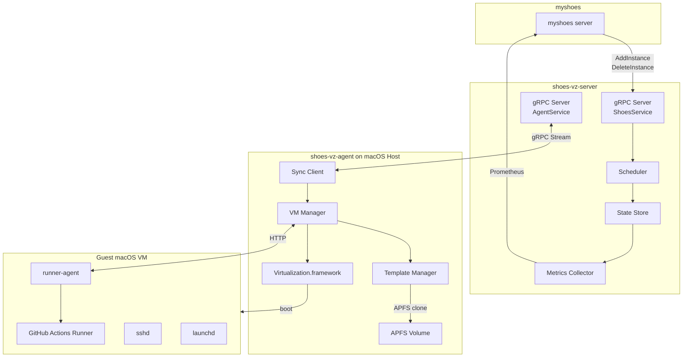
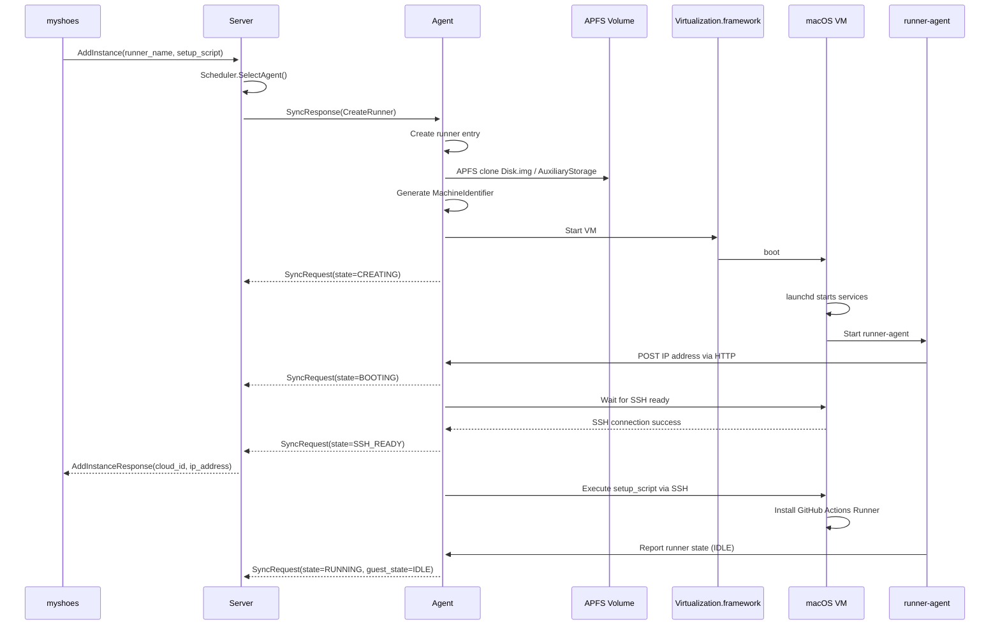
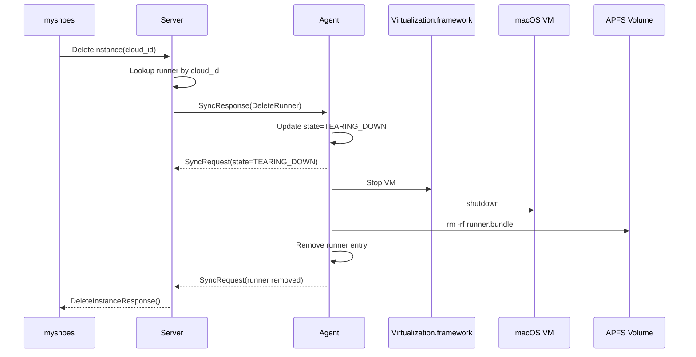

# shoes-vz Design Document

[日本語版はこちら](design.ja.md)

## Overview

shoes-vz is a tool (and future service suite) that directly leverages **Code-Hex/vz (Go bindings for Apple Virtualization Framework)** on macOS 26+ (Apple Silicon) to rapidly create, execute, and destroy GitHub Actions self-hosted runners as **ephemeral macOS VMs**.

It replaces the following characteristics of traditional GUI-based virtualization approaches:

- Indirect control via GUI applications
- Template preparation dependent on compression/decompression
- Connectivity combining bridge + fixed IP + mDNS

In this system, we **directly control** the Virtualization.framework and place **CoW-based Runner replication** using APFS Copy-on-Write (clone) at the core, minimizing startup time when SSH reachability (SSH possible) is the startup completion condition.

---

## Motivation

### Background & Challenges

1. **Cost Issues**
   - GitHub's official macOS Runner billing is expensive, and costs can easily dominate for long-running jobs.

2. **Apple Silicon Support**
   - Need build environment for ARM64 (aarch64).

3. **Need for Ephemeral Environments**
   - Clean environment needed per job to prevent state pollution.

4. **Operational & Development Complexity**
   - Side effects of GUI-based approach (opaque state, complex operation/recovery flows)
   - Difficult to optimize startup path (unnecessary processes easily creep in)

---

## Goals

- **Minimize SSH Ready Time**
  - Unify startup completion condition to "SSH connection success"
- **Ephemeral Runners**
  - Completely independent VM instances per Runner (no collisions even with concurrent runs)
- **CoW-Based Fast Replication**
  - Instantly replicate templates via APFS clone, with only diffs growing
- **macOS 26+ Prerequisite**
  - Leverage latest Virtualization.framework features
- **CLI / API-Centric Design**
  - GUI-independent. Assume future gRPC/HTTP API
- **myshoes Integration**
  - External control of Runner lifecycle

---

## Non-Goals

- **Linux / Windows VM Support**
- **Dynamic Resource Changes After VM Boot**
- **GUI-Based Operations**
- **Design That Increases Guest OS Dependencies**
  - Runner state management completes on the host side

---

## Design Details

### 5.1 Expected User (myshoes / Operator) Usage Flow

#### Initial Setup (One-time)

1. **Prerequisites**
   - Host: macOS 26+ / Apple Silicon / APFS
   - Virtualization.framework available
   - Permission to create base VM for Runners (Golden Template)

2. **Golden Template Creation (Maintenance Path)**
   - Install macOS to VM
   - Enable SSH, create Runner user, place authorized_keys
   - Place GitHub Actions runner binary (as needed)
   - Complete heavy first-boot processes (host key generation, package installation, etc.)

3. **Fix Template**
   - Store VM bundle (Disk / Auxiliary / HardwareModel, etc.) in template directory
   - Templates are read-only (write prohibited)

#### Daily Usage Flow (Fast Path)

1. Create Runner (APFS clone)
2. Boot VM
3. SSH Ready check (completion on success)
4. Run job (SSH or Runner agent)
5. Destroy (VM stop + bundle deletion)

---

### 5.2 Architecture Overview

We abolish traditional GUI-based control (app launch, bridge monitoring, mDNS duplicate checking, etc.) and implement a Server-Agent architecture.

#### Components

- **shoes-vz-server (Go)**
  - Central management server
  - Accepts Runner creation/deletion requests from myshoes
  - Manages and schedules multiple Agents
  - Collects and publishes metrics (Prometheus)
  - Provides gRPC API (ShoesService / AgentService)

- **shoes-vz-agent (Go)**
  - Runs on each macOS host
  - Controls Virtualization.framework (via vz)
  - Template management (APFS clone)
  - Runner lifecycle management
  - Bidirectional sync with Server (gRPC stream)

- **shoes-vz-runner-agent (Go)**
  - Lightweight daemon running in VM
  - Monitors GitHub Actions Runner state
  - Notifies host of IP address via HTTP
  - Automatically retrieves runner ID from .runner file
  - Exposes command execution and state via HTTP API

#### Component Architecture Diagram



---

### 5.3 File Layout Structure

#### Template (Immutable)

```
/opt/myshoes/vz/templates/macos-26/
├── Disk.img
├── AuxiliaryStorage
├── HardwareModel.json
├── TemplateMetadata.json
└── README.md
```

#### Runner (Ephemeral)

```
/opt/myshoes/vz/runners/<runner-id>.bundle/
├── Disk.img                # APFS clone (only diffs grow)
├── AuxiliaryStorage         # clone
├── MachineIdentifier.json   # Runner-specific
├── HardwareModel.json       # Copied from template
├── State.save               # optional (if using Saved State)
└── RuntimeMetadata.json     # Boot time, ssh port, etc.
```

#### State Management

```
/var/run/myshoes/
└── runner-state.json        # For external reference (myshoes integration)
```

---

### 5.4 Network Design

#### Policy

- **Use HTTP over NAT for Host-Guest Communication**
  - HTTP communication between runner-agent and Agent
  - VM boots with NAT network, obtains IP address via DHCP
  - runner-agent notifies host of IP address via HTTP POST at startup
  - Runner state monitoring and command execution via HTTP API

- **SSH Connection**
  - VM boot completion check (SSH Ready)
  - setup_script execution
  - For debugging and maintenance

#### Communication Paths

1. **VM → Agent (HTTP POST)**
   - IP address notification by runner-agent
   - Sent to Agent's IP notification server (default port 8081)

2. **Agent → VM (HTTP)**
   - Access runner-agent's HTTP API (default port 8080)
   - Command execution (/exec)
   - State retrieval (/status)
   - Health check (/health)

3. **Agent → VM (SSH)**
   - setup_script execution
   - For debugging and maintenance

4. **Server ⇔ Agent (gRPC)**
   - Runner creation/deletion commands
   - State synchronization
   - Bidirectional stream

---

### 5.5 Startup Time Definition & Measurement

Startup time is defined for the following interval:

- **Start call completion** (up to host-side `Start` API)
- to
- **SSH connection success** (when the following succeeds)

```bash
ssh -o BatchMode=yes -o ConnectTimeout=1 -p 2222 runner@127.0.0.1 true
```

Measurements must be done under identical conditions (same template, same host load), recording P50/P95.

---

## VM Asset & Identity Model (Important)

macOS VMs do not complete with "Disk only."

### 1. AuxiliaryStorage

- Auxiliary storage required for macOS VM boot.
- To maintain Runner ephemerality, **clone like Disk** and include in Runner bundle.

### 2. HardwareModel / MachineIdentifier

- HardwareModel is template-fixed.
- MachineIdentifier is newly generated per Runner, ensuring **no collisions during concurrent boots**.

---

## CoW Operations Using APFS Clone

### Basic Rules

- Template and Runner storage must be on the **same APFS volume**.
- If clone doesn't work (different volumes, network FS, etc.), neither performance nor capacity is viable.

### Runner Creation Procedure (Concept)

1. Create Runner bundle directory
2. APFS clone `Disk.img` / `AuxiliaryStorage`
3. Generate `MachineIdentifier.json`
4. Create `RuntimeMetadata.json`

---

## Saved State (Optional)

To further shorten SSH Ready time, use Saved State (VM state save).

### Operational Policy

- Have "Warm Template (with Saved State)" separate from Golden Template.
- Prioritize restore in Fast Path.

### Caution

- Saved State requires **matching VM configuration**.
  - Do not change CPU / memory / device configuration in Fast Path.

---

## API Design

shoes-vz provides gRPC API for Runner management from myshoes and communication with Agents.

### gRPC Services

#### 1. ShoesService (myshoes Plugin API)

Accepts Runner creation/deletion requests from myshoes.

```protobuf
service ShoesService {
  // Create Runner
  rpc AddInstance(AddInstanceRequest) returns (AddInstanceResponse);

  // Delete Runner
  rpc DeleteInstance(DeleteInstanceRequest) returns (DeleteInstanceResponse);
}

message AddInstanceRequest {
  string runner_name = 1;      // Runner name
  string setup_script = 2;     // Script to execute after VM boot
}

message AddInstanceResponse {
  string cloud_id = 1;         // shoes-vz-{runner-id}
  string shoes_type = 2;       // "shoes-vz"
  string ip_address = 3;       // VM IP address
}
```

#### 2. AgentService (Agent Communication API)

Manages bidirectional communication with Agents.

```protobuf
service AgentService {
  // Register Agent
  rpc RegisterAgent(RegisterAgentRequest) returns (RegisterAgentResponse);

  // State sync and command send via bidirectional stream
  rpc Sync(stream SyncRequest) returns (stream SyncResponse);
}

message RegisterAgentRequest {
  string hostname = 1;
  AgentCapacity capacity = 2;
}

message SyncRequest {
  string agent_id = 1;
  uint32 active_runners = 2;
  repeated Runner runners = 3;  // Current Runner state
}

message SyncResponse {
  oneof command {
    CreateRunnerCommand create_runner = 1;
    DeleteRunnerCommand delete_runner = 2;
    NoopCommand noop = 3;
  }
}
```

### State Sync Flow

1. Agent calls RegisterAgent at startup
2. Agent starts Sync stream
3. Agent periodically sends SyncRequest (reports Runner state)
4. Server returns commands in SyncResponse (CreateRunner / DeleteRunner / Noop)
5. Agent executes commands and reports results in next SyncRequest

### Metrics API

Publishes metrics in Prometheus format at `/metrics` endpoint.

- `shoesvz_agents_online`: Number of online Agents
- `shoesvz_agents_total`: Total number of Agents (by status)
- `shoesvz_runners_total`: Total number of Runners (by state)
- `shoesvz_capacity_total_runners`: Total capacity
- `shoesvz_runner_startup_duration`: Runner startup time

---

## State Management

Runner state is managed only on the host side, independent of guest state (since guest side is ultimately destroyed).

| State | Meaning |
|---|---|
| creating | Cloning in progress |
| booting | VM booting |
| ssh-ready | SSH connection available |
| running | Job executing |
| tearing-down | Destroying |
| error | Abnormal termination |

---

## Runner Lifecycle Flow

### Runner Create (Fast Path)



### Runner Delete



---

## Security Considerations

- Runners must be destroyed after job completion (prioritize destruction over repair)
- SSH keys are Runner-specific (limit scope of impact if leaked)
- Templates are read-only (immutability)
- Prohibit MachineIdentifier reuse (prevent concurrent collisions)

---

## Operational Notes

1. **APFS Prerequisite (Required)**
   - To enable clone, template and Runner must always be on the same APFS volume.

2. **Don't Change Configuration in Fast Path**
   - CPU/memory/device configuration changes break Saved State compatibility, causing restore failures or startup time degradation.

3. **Template Updates Only in Maintenance**
   - Do not acquire restore images, update OS, or rebuild in normal operation path (CI).

4. **Don't Repair on Failure**
   - Since Runners are ephemeral, delete VM/bundle on error and recover by recreating.

5. **Logs & Metrics**
   - Record startup time separately (clone time / boot-to-ssh / total).
   - Continuously monitor P95 to detect template bloat or host performance degradation.

---

## Appendix

### Glossary

- **AVF**: Apple Virtualization Framework
- **Template**: Immutable Golden VM asset
- **Runner**: Ephemeral VM instance cloned from template
- **SSH Ready**: State where SSH connection (command execution) succeeds

### Reference (Differences from Existing Design)

- Abolished bridge/mDNS/compression dependencies
- Adopted APFS clone as core
- Fixed startup completion condition to SSH
